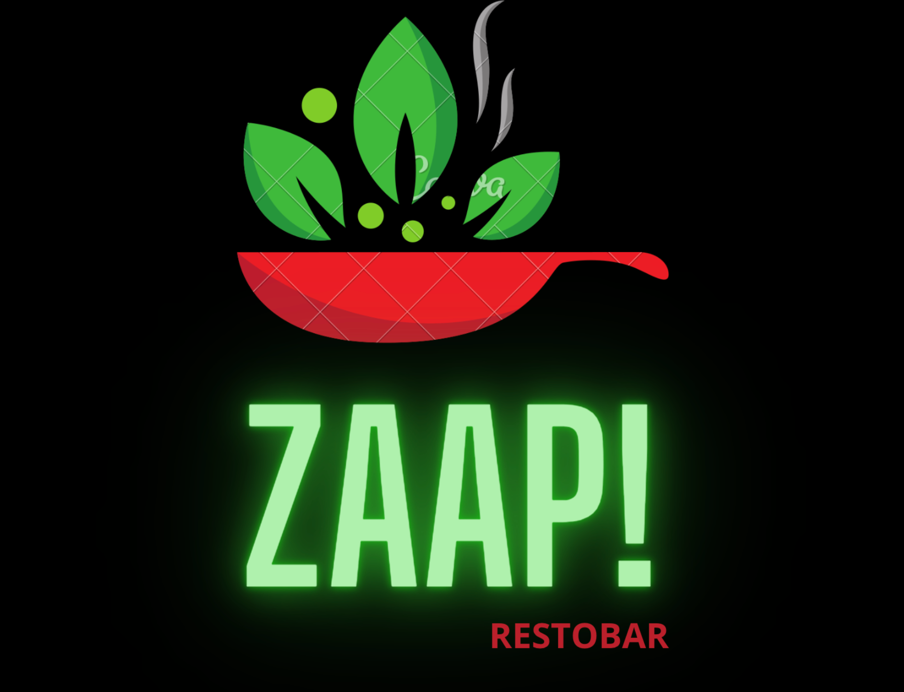
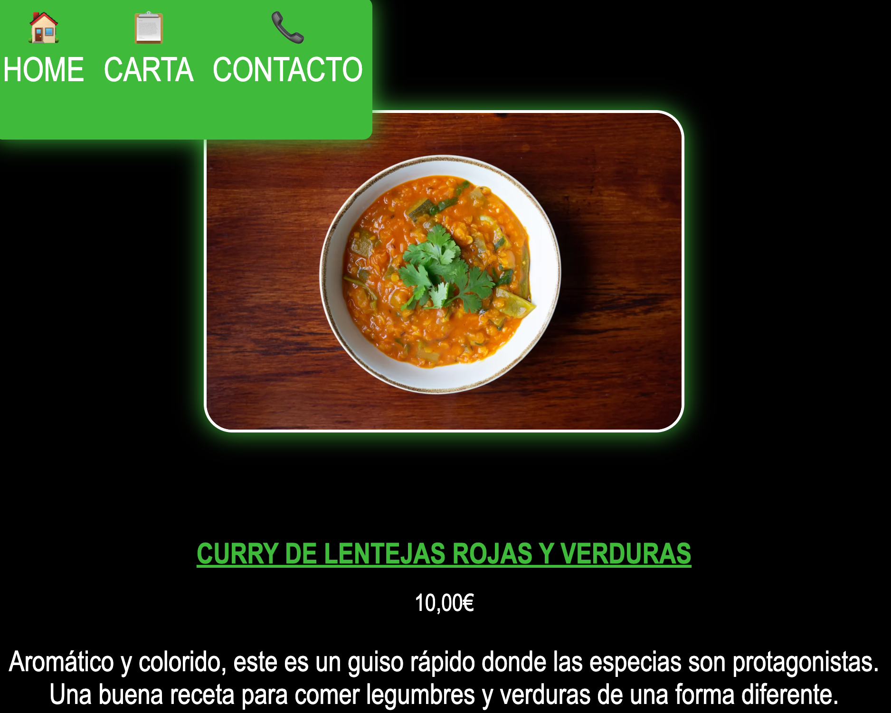
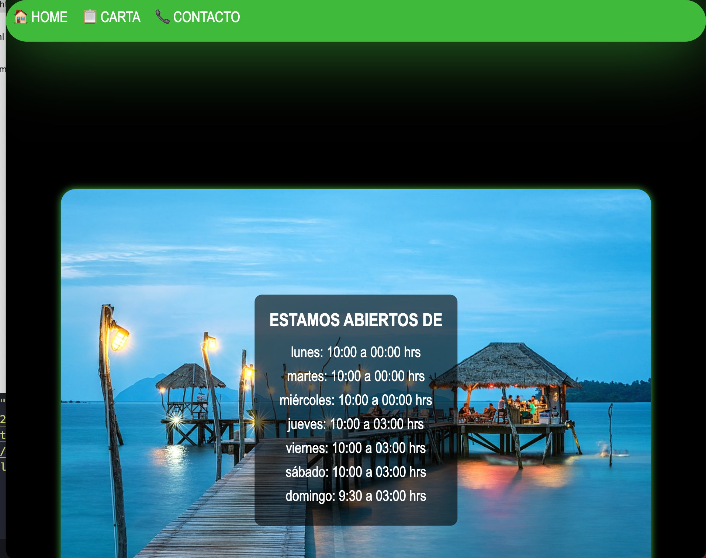

# Mi primer proyecto  

  
Carta restaurante 📝

  <ol>
    <li><a href="#objetivo-🎯">Objetivo</a></li>
    <li><a href="#sobre-el-proyecto-🔎">Sobre el proyecto</a></li>
    <li><a href="#deploy-🚀">Deploy</a></li>
    <li><a href="#vistas">Vistas</a></li>
    <li><a href="#contacto">Contacto</a></li>
  </ol>

## Objetivo 🎯
Este proyecto consiste en realizar una pagina web con html y css.

## Sobre el proyecto  🔎
Decidí esta temática porque me encanta la comida asiática
## Deploy 🚀
-Configuración del servidor
-Variables de entorno
-Instrucciones de despliegue
-Configuración de proxy o redirección de trafico
-Configuración de certificados SSL
-Scripts de Post-despliegue
-Configuración de monitoreo y registro
-Credenciales de acceso remoto

    https://github.com/Iki-leo/carta-restaurante.git

## Vistas
Ejemplo

## Contacto

 

